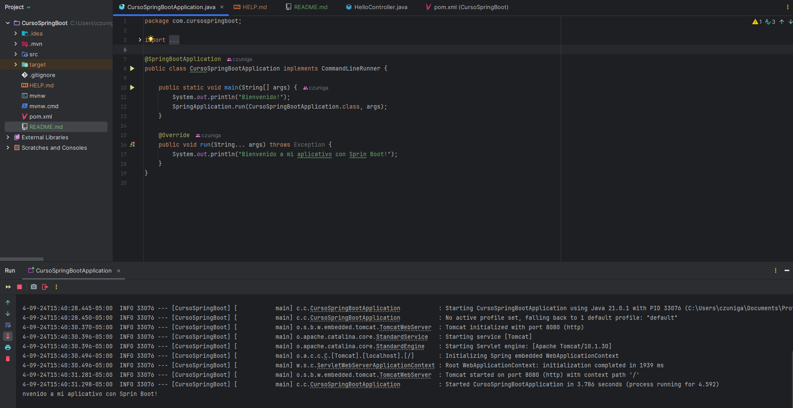
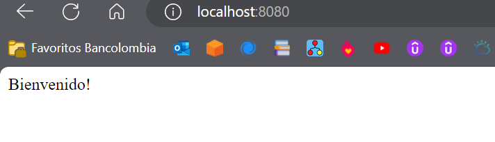

# CursoSpringBoot





## Description
Demo project for Spring Boot.

## Requirements
- Java 17
- Maven

## Installation
1. Clone the repository:
    ```sh
    git clone <repository-url>
    ```
2. Navigate to the project directory:
    ```sh
    cd CursoSpringBoot
    ```
3. Build the project using Maven:
    ```sh
    mvn clean install
    ```

## Running the Application
To run the application, use the following command:
```sh
mvn spring-boot:run

Alternatively, you can run the CursoSpringBootApplication class directly from your IDE.  
Endpoints
GET / - Returns "Bienvenido!"
License
This project is licensed under the MIT License.
